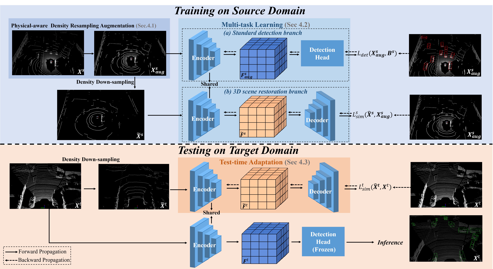

[](https://arxiv.org/abs/2311.10845)


# Domain Generalization of 3D Object Detection by Density-Resampling

In `3D-Density-Resampling-SDG`, we propose an SDG method to improve the generalizability of 3D object detection to unseen target domains. Specifically, from the perspective of data augmentation, we design a universal physical-aware density-resampling data augmentation (PDDA) method to mitigate the performance loss stemming from diverse point densities. 
From the learning methodology viewpoint, we develop a multi-task learning for 3D object detection: during source training, besides the main standard detection task, we leverage an auxiliary self-supervised 3D scene restoration task to enhance the comprehension of the encoder on background and foreground details for better recognition and detection of objects.
Furthermore, based on the auxiliary self-supervised task, we propose the first test-time adaptation method for domain generalization of 3D object detection, which efficiently adjusts the encoder's parameters to adapt to unseen target domains during testing time, to further bridge domain gaps.



&ensp;
## Installation for 3DTrans

You may refer to [INSTALL.md](docs/INSTALL.md) for the installation of `3D-Density-Resampling-SDG`.

## Getting Started & Training-Testing for `DG` Setting

* Please refer to [Readme for Datasets](docs/GETTING_STARTED_DB.md) to prepare the dataset and convert the data into the 3DTrans format.

Here, we take Waymo-to-NuScenes consolidation as an example.

### Source-training stage: train a baseline detection model on the source dataset: 
Train with consistent point-cloud range (employing Waymo range) using multiple GPUs (take 2 GPUs for example):
```shell script
CUDA_VISIBLE_DEVICES=0,1 bash scripts/DG/dist_train_dg.sh 2 \
--cfg_file ./cfgs/DG/waymo_to_nuscenes/voxel_rcnn_feat_3.yaml
```
Or single GPU:
```shell script
python  train_multi_db_merge_loss.py \
--cfg_file ./cfgs/DG/waymo_to_nuscenes/voxel_rcnn_feat_3.yaml \
--batch_size 2 --epochs 30
```

### Decoder-training stage: train a decoder of detection model for the scene restoration: 
Train the decoder using single GPU:
```shell script
python  train_multi_db_dg_res_decoder.py \
--cfg_file ./cfgs/DG/waymo_to_nuscenes/voxel_rcnn_feat_3_PDDA_AE_DownSam_Decoder.yaml \
--pretrained_model ${source_pretrained_model}.pth \
--pretrained_pointnet2 ${pretrained_pointnet2_model}.pth \
--batch_size 2 --epochs 5
```

### Normal testing stage: 
Test the trained checkpoint of the detection model using single GPU:
```shell script
python  test.py \
--cfg_file ./cfgs/DG/waymo_to_nuscenes/xxx.yaml \
--ckpt ../${to_be_test_checkpoint}.pth \
--batch_size 1 --db_test ${`1` for DATA_CONFIG in config yaml; `3` for DATA_CONFIG_TEST}
```

### Test-time adaptation: test-time adapt the model on target dataset and test the model: 
Test-time adaptation using single GPU:
```shell script
python train_multi_db_dg_AE_TTT.py \
--cfg_file ./cfgs/DG/waymo_to_nuscenes/voxel_rcnn_feat_3_AE_DownSam_TTT_nuscenes.yaml \
--pretrained_model ${decoder_trained_model}.pth \
(optional) --pretrained_pointnet2 ${pretrained_pointnet2_model}.pth \
--iter_num_per_tar 5 --batch_size 1
```

&ensp;
## Model Zoo: 

Due to [Waymo Dataset License Agreement](https://waymo.com/open/terms/), we could not provide the Waymo-related pretrained models, but you could easily achieve similar performance by training with the corresponding configs. Regarding the NuScenes-related pretrained models, you can find them in [`pretrained models`](https://drive.google.com/drive/folders/1V8z3RXMmPWovEI7Pa4DXKk40xrPYMww0?usp=drive_link) and easily reproduce the performance in the paper.


&ensp;
## Acknowledge
* Our code is heavily based on [OpenPCDet](https://github.com/open-mmlab/OpenPCDet) and [3DTrans](https://github.com/PJLab-ADG/3DTrans). Thanks for their awesome codebases.


## Citation
If you find this project useful in your research, please consider citing:
```
@article{li2023domain,
  title={Domain Generalization of 3D Object Detection by Density-Resampling},
  author={Li, Shuangzhi and Ma, Lei and Li, Xingyu},
  journal={arXiv preprint arXiv:2311.10845},
  year={2023}
}
```

